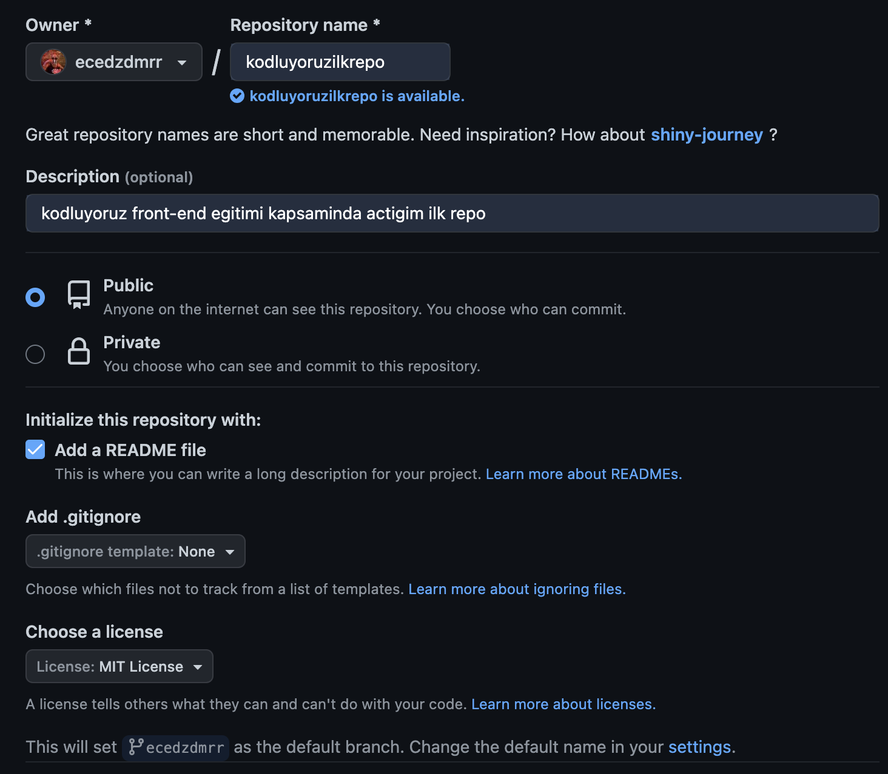

# Kodluyoruz Ilk Repo

Bu repo [kodluyoruz][1] front-end eğitiminde oluşturduğum ilk repo. Içerisinde READ.ME dosyası ve bir adet de index.html barındırıyor.
## Installation
Öncelikle repoyu clonelayın. (Buraya kendi reponuzdan aldığınız link gelecek)
```
git clone https://github.com/ecedzdmrr/kodluyoruzilkrepo.git
```
## Usage
Projeyi cloneladıktan sonra Visual Studio Code programında açınız.

Linux için:
```
cd kodluyoruzilkrepo
code .
```
## Contributing
Pull requestler kabul edilir. Büyük değişiklikler için lütfen önce neyi değiştirmek istediğinizi tartışmak için bir konu açınız.
## License
[MIT][2]


[1]: https://kodluyoruz.org/
[2]: https://choosealicense.com/licenses/mit/